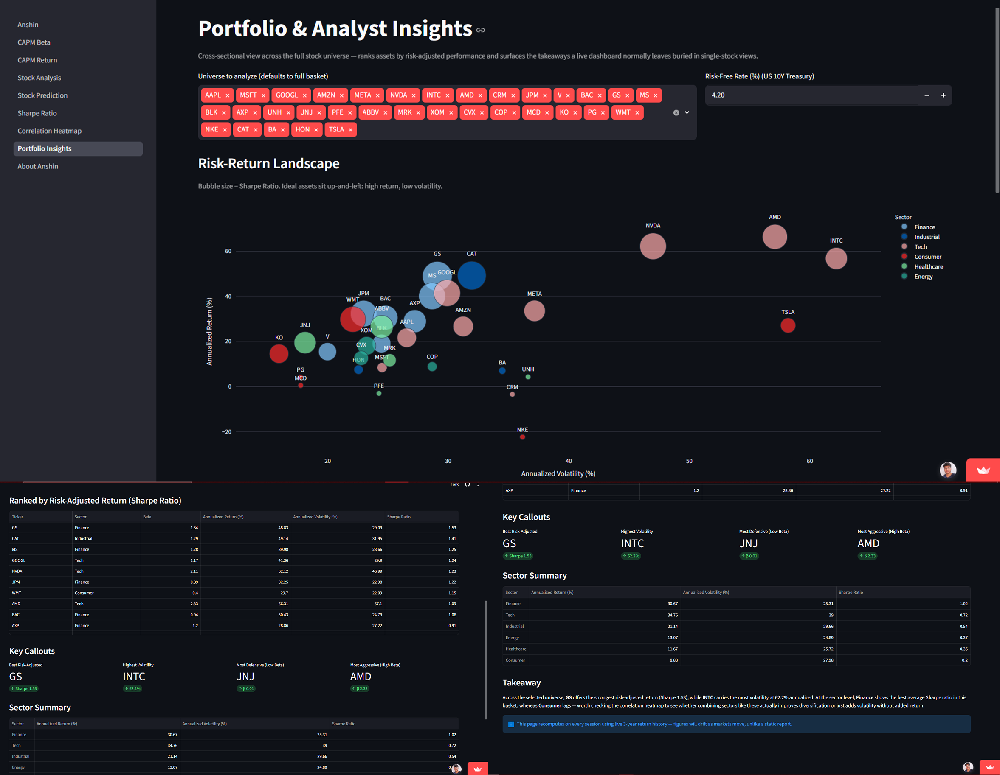
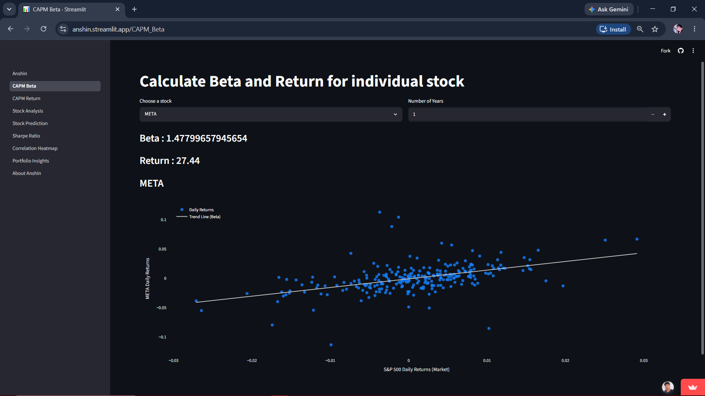
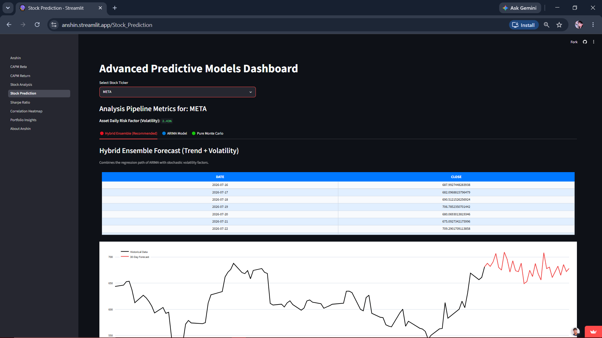
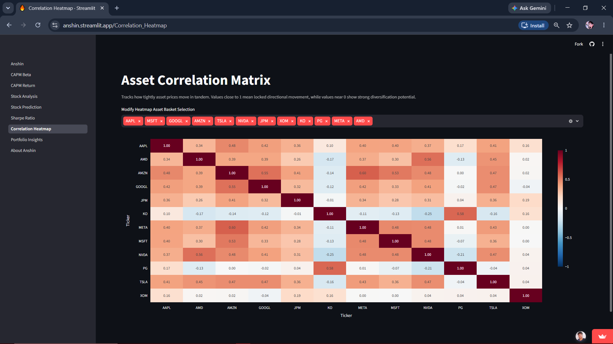

# Anshin — Quantitative Equity Analytics & Risk Intelligence Platform

**Live App:** [anshin.streamlit.app](https://anshin.streamlit.app/)

**Repo:** [github.com/butterboypy/AnShin](https://github.com/butterboypy/AnShin)

> **Anshin (安心)** — a Japanese term for structured peace of mind. Applied here to financial risk: turning raw market data into clear, decision-ready analysis.


---

## 1. Project Overview

### Business Problem

Retail investors and analysts often rely on charting tools that show price movement but skip the risk analysis needed to actually evaluate an asset — is this stock's return worth the volatility it carries? How does it compare to others? Is it actually diversifying a portfolio, or just adding noise?

- **Primary Question:** Across a basket of 32 stocks spanning 6 sectors, which assets offer the best risk-adjusted return, and how do sectors compare on that basis?

Anshin answers this with live data — CAPM/Beta modeling, Sharpe Ratio ranking, correlation analysis, and a hybrid ARIMA + Monte Carlo forecasting engine — instead of static screenshots or a one-time report.

### Interactive Dashboard Demonstration

**Live App:** [Explore Anshin](https://anshin.streamlit.app/)

The app has 8 pages: CAPM Beta, CAPM Return, Stock Analysis, Stock Prediction, Sharpe Ratio, Correlation Heatmap, Portfolio Insights, and full technical documentation (About).

---

## 2. Key Findings & Insights



*Note: all figures below are a snapshot from live data at the time of writing. Since Anshin pulls real-time prices, running the app today will show different — but always current — numbers.*

### Risk-Adjusted Return Leaders

- Across the 32-stock universe, **Caterpillar (CAT)** led on risk-adjusted return with a **Sharpe Ratio of 1.51**, driven by a strong **52.16% annualized return** against **31.86% volatility**.
- **NVDA** posted the highest raw annualized return (**62%+**) but also the highest volatility in the basket (**~47%**), landing its Sharpe Ratio around **1.24** — a reminder that raw return alone is a misleading ranking metric.

### Sector-Level Patterns

- **Finance** and **Industrial** sectors showed the strongest average Sharpe Ratios in the current snapshot, while **Consumer** and **Energy** lagged — offering lower risk-adjusted return over the same window.
- The correlation heatmap shows **Tech names cluster tightly** (0.4–0.5 correlation), meaning holding multiple tech stocks together adds limited diversification benefit. Defensive names like **KO** and **JNJ** show near-zero correlation to tech, offering genuine diversification value in a mixed portfolio.

### Forecasting Behavior

- The hybrid ARIMA + Monte Carlo forecasting model consistently produces a **smoother directional trend** than pure Monte Carlo alone, while still preserving realistic day-to-day volatility — avoiding both the unrealistic flatness of pure ARIMA and the excess noise of pure random-walk simulation.

---

## 3. How This Translates to Decisions

- **Portfolio construction:** Favor a mix across sectors with low pairwise correlation (e.g., a Tech + Defensive Consumer pairing) rather than concentrating in high-Sharpe names within the same sector — correlation matters as much as individual asset quality.
- **Risk-adjusted screening:** Use Sharpe Ratio, not raw return, as the first filter when comparing assets — a high-return stock with proportionally higher volatility (like NVDA) isn't automatically the better holding versus a steadier performer (like CAT) once risk is priced in.
- **Forecast interpretation:** Treat the Hybrid Ensemble forecast as the primary reference for expected price *path shape*, and use the pure Monte Carlo output separately to gauge the *range of plausible outcomes* (i.e., risk bounds), rather than reading either forecast as a single point prediction.

---

## 4. Methodology

Anshin runs each dataset through a live, multi-stage analytical pipeline:

1. **Live Data Ingestion:** Pulls daily OHLCV data via the yfinance API for both individual tickers and the S&P 500 benchmark, with date alignment and missing-value handling.
2. **CAPM & Beta Modeling:** Computes Beta via covariance/variance regression against the S&P 500, then derives expected return using the current risk-free rate (10Y Treasury yield) via the CAPM formula: `E(Ra) = Rf + β(Rm − Rf)`.
3. **Risk-Adjusted Performance (Sharpe Ratio):** Calculates annualized return and volatility (σ scaled to 252 trading days), then ranks assets by `(Annualized Return − Rf) / σ`.
4. **Cross-Asset Correlation:** Builds a Pearson correlation matrix across daily returns for a user-selected basket, surfacing true diversification opportunities versus false diversification (assets that look different but move together).
5. **Time-Series Forecasting:** Runs three parallel models — pure ARIMA (with Augmented Dickey-Fuller-gated differencing order), pure Monte Carlo (geometric Brownian motion), and a Hybrid Ensemble that multiplies the ARIMA trend by the Monte Carlo shock factor at each step.
6. **Portfolio-Level Synthesis:** Aggregates all of the above across the full stock universe on a dedicated Insights page, producing sector-level rankings and a written takeaway generated from the current live numbers — rather than requiring manual cross-referencing across single-stock pages.

### End-to-End Data Pipeline

```
[yfinance API] → [Raw OHLCV Arrays] → [Pandas Cleaning & Date Alignment]
       ↓
[Beta, Returns, ARIMA, GBM, Sharpe, Correlation]
       ↓
[Dark-themed interactive Plotly figures]
       ↓
[Streamlit Multi-page App] → [Dashboard output layer]
```

---

## 5. Dashboard Screenshots

**CAPM Beta — Systemic Risk Regression**


**Stock Prediction — Hybrid Ensemble Forecast**


**Correlation Heatmap — Cross-Asset Dependency Matrix**


---

## 6. Skills Demonstrated

- **Python:** Pandas, NumPy, Statsmodels (ARIMA, ADF testing), yfinance, vectorized time-series computation
- **Quantitative Finance:** CAPM, Beta, Sharpe Ratio, Pearson correlation, geometric Brownian motion, risk-adjusted portfolio theory
- **Data Visualization:** Plotly (interactive candlestick, scatter, heatmap, and bar charts with custom dark theme)
- **Software Engineering:** Modular architecture (separated data/calculation/presentation layers), live-data caching, multi-page Streamlit application design
- **Deployment:** Cloud deployment via Streamlit Community Cloud with dependency management and CI-style auto-redeploy on push

---

## 7. Repo Structure

```
Anshin/
├── pages/
│   ├── utils/
│   │   ├── model_train.py       # ARIMA + Monte Carlo forecasting logic
│   │   └── plotly_figure.py     # Chart styling and layout helpers
│   ├── 1_CAPM_Beta.py           # Single-stock Beta and CAPM return
│   ├── 2_CAPM_Return.py         # Multi-stock CAPM comparison
│   ├── 3_Stock_Analysis.py      # Fundamentals + technical indicators
│   ├── 4_Stock_Prediction.py    # 30-day forecasting dashboard
│   ├── 5_Sharpe_Ratio.py        # Risk-adjusted return ranking
│   ├── 6_Correlation_Heatmap.py # Pairwise correlation matrix
│   ├── 7_Portfolio_Insights.py  # Full technical documentation
│   └── 8_About_Anshin.py        # Cross-stock ranking and takeaways
├── capm_functions.py            # Shared Beta/return/plotting functions
├── requirements.txt             # Pinned dependencies
└── Anshin.py                    # App entry point
```

---

## Author

**Krishnendu Das**
[GitHub](https://github.com/butterboypy) · [LinkedIn](https://www.linkedin.com/in/krishnendudas2002)
